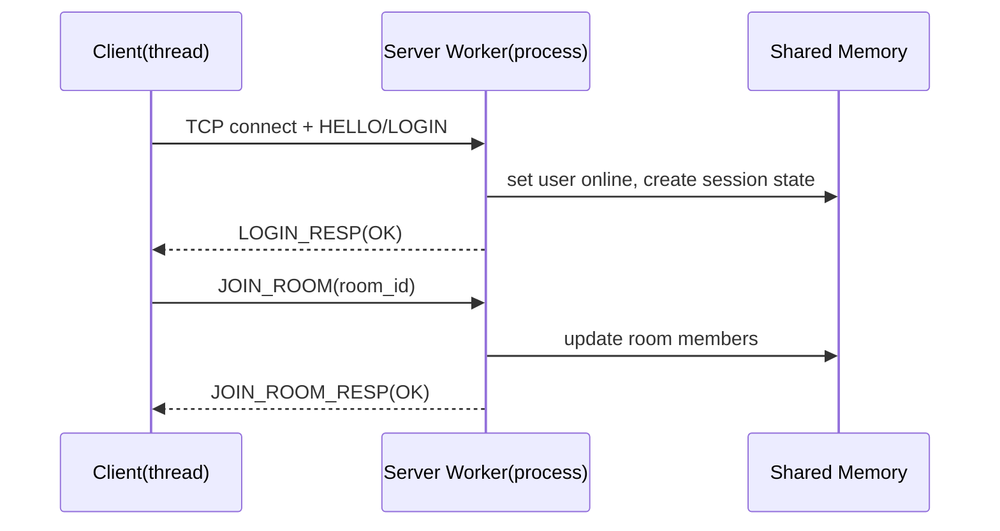
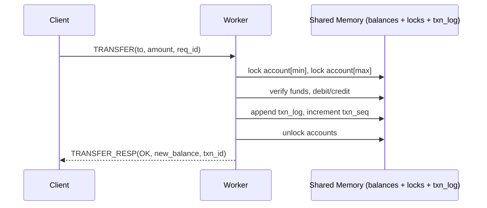

# A++-Oriented Project Spec: Trading Chatroom (Linux / Multi-Process / Shared Memory IPC / Custom Protocol)

## 1) Application introduction (what & why)

This project implements an integrated service: **Chatroom + Trading/Banking System**.

- **Chat**: users can log in, join rooms, send group messages, (optional) direct messages, and (optional) query online status.
- **Trading/Banking**: each user has an account balance and can perform **DEPOSIT / WITHDRAW / TRANSFER / BALANCE**.
  - The core requirement is **data consistency under multi-process concurrency** (you can describe it using ACID; this project focuses primarily on **A/C/I**).

We intentionally avoid HTTP/WebSocket and use a **custom application-layer protocol** to demonstrate:

- **High concurrency**: multi-threaded client stress test (≥ 100 concurrent connections)
- **OS mechanisms**: multi-process server + shared memory IPC + locks/semaphores
- **Availability**: heartbeat/timeout/graceful shutdown
- **Auditability**: transaction logs, metrics, fault injection, and analysis (Auditing discussion)

---

## 2) System architecture (Multi-process + Shared Memory IPC)

### 2.1 Server process model (recommended: Master-Worker + prefork)

- **Master process**
  - Accepts new connections (or owns the listen socket and manages workers)
  - Manages workers (fork, monitor, restart)
  - Handles signals: SIGINT/SIGTERM → graceful shutdown
  - Exports metrics (e.g., print every 1s / 5s)

- **Worker processes (N)**
  - Handle client I/O (read frame → parse → handle → write response)
  - Share chat and ledger state via **shared memory**
  - Trading operations must follow the locking strategy (see 3.2)

> Connection distribution: on Linux you can use `SO_REUSEPORT` so each worker can `accept()` independently, or let the master accept and then dispatch fds (the latter requires extra IPC). To keep the project focused on shared memory, `SO_REUSEPORT` is a good, simpler option.

### 2.2 Shared memory layout (key: state sync + counters + cache)

Shared memory should include at least:

- **Global metrics**
  - `total_requests`
  - `total_connections`
  - `op_counts[opcode]`
  - latency histogram (optional)
- **User / session**
  - `user_id` ↔ `username` (small fixed table or hash)
  - online status (online/offline)
  - `session_table`: fd→user_id mapping (if each worker accepts its own fds, fds are worker-local; in that case keep per-worker sessions locally and store only user online state in shared memory)
- **Chat rooms**
  - room member set (bitset or fixed array)
  - room message/event ring buffer (optional: replay/offline messages)
- **Ledger**
  - `balance[user_id]`
  - `txn_seq` (global transaction sequence)
  - `txn_log` (fixed-size ring buffer for auditing)

---

## 3) Consistency & locking design (A++ focus for trading)

### 3.1 Consistency goals (write these in your report)

- **Atomicity**: TRANSFER must be “debit + credit succeeds together or fails together”
- **Isolation**: concurrent transactions must be equivalent to some serial execution order
- **Consistency**: balances never become invalid (e.g., never negative if that’s a rule) and never change “out of thin air” due to races

### 3.2 Locking strategy (shared memory + semaphore / futex / pthread robust mutex)

Recommended, easy-to-audit approach:

- **One lock per account**: `account_lock[user_id]`
- **TRANSFER**: lock both accounts (`from`, `to`)
  - **Fixed lock order**: lock `min(from,to)` first, then `max(from,to)` to avoid deadlocks
- **Global txn sequence / txn log**: a dedicated `txn_lock`, or atomics plus head/tail lock for a ring buffer

Chat can be more relaxed:

- `room_lock[room_id]` protects member lists and message buffers
- Or use RWLock for read-heavy workloads (optional)

---

## 4) Custom application protocol (HTTP/WS prohibited)

### 4.1 Frame overview

**Fixed header + variable body**, using **network byte order (big-endian)** everywhere.

Header (recommended 32 bytes for alignment and extensibility):

- `magic` (2) = 0x4E53 ("NS")
- `version` (1) = 1
- `flags` (1) = bit0: encrypted, bit1: compressed(optional), bit2: is_response
- `header_len` (2) = 32
- `body_len` (4)
- `opcode` (2)
- `status` (2) = 0 success; non-zero error code (response only)
- `req_id` (8) = client-side incrementing id for response correlation/retry (optional)
- `checksum` (4) = CRC32(header_without_checksum + body) or Adler32
- `reserved` (6) = 0

Body: defined per opcode (prefer length-prefixed strings: `u16 len + bytes`).

### 4.2 OpCodes (chat + trading)

Auth/connection:

- `0x0001 HELLO` (handshake; returns server capabilities)
- `0x0002 LOGIN` (username/password; simplified can be username + nonce)
- `0x0003 LOGOUT`
- `0x0004 HEARTBEAT` (keep-alive)

Chat:

- `0x0101 JOIN_ROOM` (room_id)
- `0x0102 LEAVE_ROOM`
- `0x0103 CHAT_SEND` (room_id + message)
- `0x0104 CHAT_BROADCAST` (server→client push: message + from + ts)

Trading:

- `0x0201 DEPOSIT` (amount)
- `0x0202 WITHDRAW` (amount)
- `0x0203 TRANSFER` (to_user + amount)
- `0x0204 BALANCE` (query)
- `0x0205 TXN_HISTORY` (optional: return last N txns from shared-memory ring buffer)

### 4.3 Error codes (status)

Examples:

- `0x0000 OK`
- `0x0001 ERR_BAD_PACKET` (invalid length/fields)
- `0x0002 ERR_CHECKSUM_FAIL`
- `0x0003 ERR_UNAUTHORIZED`
- `0x0004 ERR_NOT_FOUND` (room/user)
- `0x0005 ERR_INSUFFICIENT_FUNDS`
- `0x0006 ERR_RATE_LIMIT` / `ERR_SERVER_BUSY`
- `0x0007 ERR_TIMEOUT`

---

## 5) Flow explanation (A++ required: end-to-end)

### 5.1 Login and join room (simplified)

### 5.2 Trading (TRANSFER with lock order)

### 5.3 Chat broadcast (same-room push)

- When a worker receives `CHAT_SEND`, it reads room membership from shared memory and pushes messages to online users in that room.
- With multiple workers and distributed connections, you must define a cross-worker broadcast strategy:
  - **Naive**: each worker only pushes to its own connections → not recommended (users on other workers won’t receive messages)
  - **A++ recommendation**: store a **room event ring buffer** in shared memory; each worker polls new events and pushes to the connections it manages (optionally use `eventfd` to wake workers)

---

## 6) Security (at least 1; A++ recommends 2)

Do both for a clean auditing story:

- **Integrity**: CRC32/Adler32 checksum; on failure, drop the packet immediately + record `ERR_CHECKSUM_FAIL`
- **Authentication**: a simple LOGIN handshake
  - Example: server returns `server_nonce` in `HELLO`, client sends `LOGIN(username, H(password, nonce))` (can be a simple hash or XOR demo)

(Extra) Payload encryption:

- When `flags.encrypted=1`, encrypt the body using XOR (demo) or AES-CTR (advanced)

---

## 7) Reliability (at least 1; A++ recommends 3)

- **Heartbeat / Keep-alive**
  - client sends `HEARTBEAT` every X seconds
  - worker tracks `last_seen`; timeout → treat as disconnected and clean up session
- **Timeout handling**
  - set socket read/write timeouts
  - on server busy, return `ERR_SERVER_BUSY`; client uses exponential backoff
- **Graceful shutdown**
  - SIGINT: stop accepting → notify workers → workers stop taking new requests and drain existing connections → detach shared memory + clean up semaphores

---

## 8) Client (stress test & simulation)

### 8.1 Multi-threaded design

- thread pool (e.g., 8/16/32 threads)
- each thread maintains multiple connections (or one per thread); total connections ≥ 100
- configurable request mix:
  - Chat-heavy: `CHAT_SEND` 80% + `HEARTBEAT` 20%
  - Trade-heavy: `TRANSFER/WITHDRAW/DEPOSIT/BALANCE` (custom ratios)
  - Mixed: 50/50

### 8.2 Metrics (bonus, but strongly recommended for A++)

- **Latency**: p50 / p95 / p99 (measure using `req_id` correlation)
- **Throughput**: req/s (count successes and failures separately)
- **Errors**: timeout, busy, checksum fail, auth fail

Output format:

- console summary + CSV (use `gnuplot` for plots; or aggregate with `awk/sed`)

---

## 8.3 Linux implementation notes (make it concrete)

- **Shared memory**: `shm_open` + `ftruncate` + `mmap` (or System V `shmget/shmat`)
- **Inter-process synchronization (locks)**:
  - POSIX semaphores: `sem_open/sem_wait/sem_post` (very straightforward across processes)
  - or place `pthread_mutex` in shared memory and set `PTHREAD_PROCESS_SHARED` (advanced; can add robust mutex)
- **I/O health**: `setsockopt` (`SO_RCVTIMEO` / `SO_SNDTIMEO` / `TCP_NODELAY`), `epoll` (if using an event-driven loop)

---

## 9) Real Test (A++ required: real measurements)

Run at least the following (30–60 seconds each):

1. **100 conn / mixed workload**: p50/p95/p99 + req/s
2. **200 conn / trade-heavy**: observe lock contention and throughput drop
3. **payload size sweep**: chat message 32B → 256B → 1KB
4. **worker scaling**: N=1/2/4/8 workers (same machine)

Required evidence:

- runtime screenshots (server start, client stress test, metrics output)
- metrics table + plots (at least one latency quantiles plot and one throughput plot)

---

## 10) Auditing discussion (A++ required)

### 10.1 Protocol & input auditing

- enforce a maximum `body_len` (prevent length-bomb / OOM)
- correct frame reassembly for partial reads/writes
- checksum failure policy: drop + count + optional rate limiting
- opcode/state machine: reject trading/chat ops before login

### 10.2 Concurrency auditing (trading correctness)

- deadlock prevention: fixed lock order for transfers
- race tests: concurrent transfers should preserve “total assets” (invariant)
- asset conservation check: sum of all balances + external deposits remains consistent

### 10.3 Fault injection (strong bonus)

- `kill -9` any worker: master restarts it; shared memory state remains consistent
- network faults: client reconnect; heartbeat timeout triggers cleanup
- SIGINT: graceful shutdown; confirm IPC/semaphores are cleaned up

### 10.4 Performance auditing

- explain why p99 latency spikes in trade-heavy workloads (lock contention)
- improvement option (pick one and show before/after):
  - reduce txn_log lock granularity (striped locks)
  - per-account locks instead of a global lock (with comparative charts)

---

## 11) Modularity & libraries (required: .a/.so)

Split at least these shared components into libraries:

- `libproto.a`: frame encode/decode, checksum, opcode definitions
- `libnet.a`: socket wrappers, `readn/writen`, timeouts
- `liblog.a`: structured logging (pid, req_id, opcode, status)

---

## 12) Build & repo (submission requirements)

- GitHub repository (tags/releases optional but recommended)
- `Makefile` or `CMakeLists.txt`: one-command build for client/server/libs
- `README` must include:
  - roles & responsibilities (each member owns at least one module)
  - how to build and run server/client
  - Real Test commands and results (tables/plots/screenshots)

