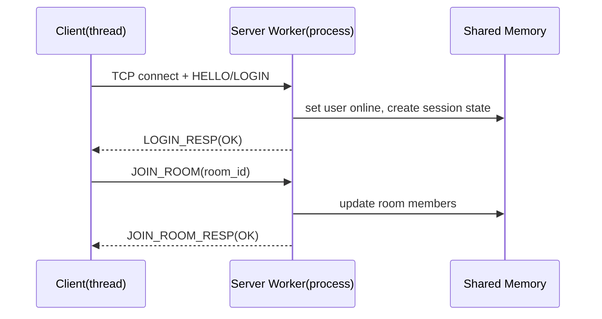
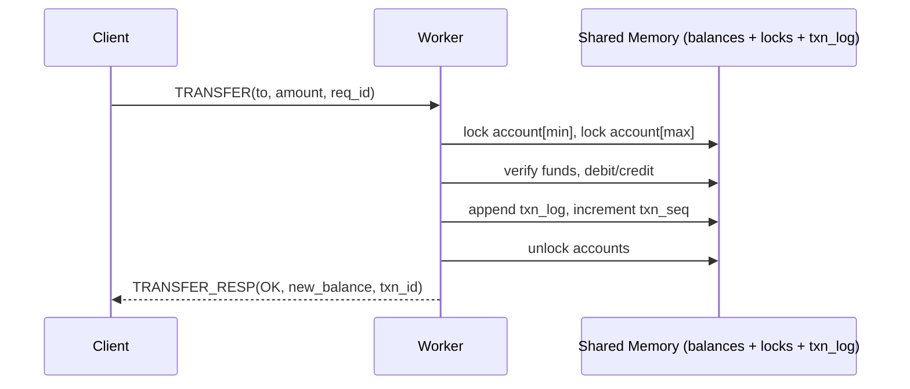

# Final Project: Trading Chatroom (High-Concurrency Client-Server System)

This project implements a **high-concurrency client-server network service** combining:

- **Chatroom**: login, join rooms, group messaging, server push (broadcast)
- **Trading/Banking**: `DEPOSIT / WITHDRAW / TRANSFER / BALANCE`

Key OS/architecture focus:

- **Client**: multi-threaded stress testing (≥ 100 concurrent connections)
- **Server**: multi-process architecture
- **IPC**: shared memory for state synchronization and counters (with locking)
- **Custom application-layer protocol** (HTTP/WebSocket are prohibited)
- **Security / Reliability**: checksum, (optional) authentication, heartbeat, timeout, graceful shutdown
- **A++ extras**: Real Test + Auditing discussion (fault injection + analysis)

---

## Project Goal

Build a client-server system with high concurrency, a custom protocol, and reliability/security mechanisms, demonstrating mastery of OS primitives (**Process / Thread / IPC**) and solid software architecture design.

---

## Application Overview

### What can you do?

- **Chat**
  - user login
  - join/leave rooms
  - send messages to a room
  - receive server broadcast (push)

- **Trading**
  - deposit `DEPOSIT`
  - withdraw `WITHDRAW`
  - transfer `TRANSFER`
  - query balance `BALANCE`

### Why combine trading with chat?

Trading under multi-process concurrency naturally exposes race conditions and consistency challenges (e.g., simultaneous transfers/withdrawals), which is ideal for showcasing:

- shared-memory state sharing
- correctness of locks/semaphores
- deadlock avoidance
- auditing (invariants, fault injection, performance bottleneck analysis)

---

## Flow Explanation

### Login & join room



### Trading (TRANSFER: fixed lock order avoids deadlock)



---

## Architecture

### Server: Multi-Process (Master-Worker / prefork)

- **Master process**
  - starts and manages workers (fork, monitor, restart)
  - handles SIGINT/SIGTERM (graceful shutdown)
  - exports metrics (connections, req/s, op counts, error counts, ...)

- **Worker processes**
  - handle client I/O: read frame → parse → handle → response
  - share chat/trading state via **shared memory**
  - enforce the locking strategy for trading operations

> On Linux, connection distribution can use `SO_REUSEPORT` so each worker can `accept()` independently, avoiding “master dispatching fds” complexity.

### IPC: Shared Memory

Shared memory should include:

- **Global metrics**: `total_requests`, `total_connections`, `op_counts[opcode]`, error counts
- **Users**: `user_id <-> username`, online/offline
- **Chat rooms**: member set, room event ring buffer (cross-worker broadcast)
- **Ledger**: `balance[user_id]`, `txn_seq`, `txn_log` (ring buffer for auditing)

### Concurrency & consistency

Consistency goals:

- **Atomicity**: debit+credit for TRANSFER succeeds together or fails together
- **Isolation**: concurrent transactions are equivalent to some serial order
- **Consistency**: balances never change incorrectly due to races (support asset-conservation checks)

Recommended locking:

- **One lock per account**: `account_lock[user_id]`
- **TRANSFER** locks two accounts with fixed order: `min(from,to)` then `max(from,to)`
- `txn_log` can use `txn_lock` or head/tail locks for ring buffer

Linux API suggestions:

- shared memory: `shm_open` + `ftruncate` + `mmap`
- inter-process sync:
  - POSIX semaphores: `sem_open/sem_wait/sem_post`
  - or `pthread_mutex` in shared memory with `PTHREAD_PROCESS_SHARED` (advanced)

---

## Custom Protocol Spec

### Frame header (recommended 32 bytes, network byte order / big-endian)

- `magic` (2) = 0x4E53 ("NS")
- `version` (1) = 1
- `flags` (1) = bit0: encrypted, bit1: compressed(optional), bit2: is_response
- `header_len` (2) = 32
- `body_len` (4)
- `opcode` (2)
- `status` (2) = 0 success; non-zero error code (response only)
- `req_id` (8) = client incrementing id (correlate responses / measure latency)
- `checksum` (4) = CRC32/Adler32(header_without_checksum + body)
- `reserved` (6) = 0

Body is defined per opcode (recommend length-prefixed strings: `u16 len + bytes`).

### OpCodes

Auth/connection:

- `0x0001 HELLO`
- `0x0002 LOGIN`
- `0x0003 LOGOUT`
- `0x0004 HEARTBEAT`

Chat:

- `0x0101 JOIN_ROOM`
- `0x0102 LEAVE_ROOM`
- `0x0103 CHAT_SEND`
- `0x0104 CHAT_BROADCAST` (server push)

Trading:

- `0x0201 DEPOSIT`
- `0x0202 WITHDRAW`
- `0x0203 TRANSFER`
- `0x0204 BALANCE`
- `0x0205 TXN_HISTORY` (optional)

### Status / error codes (examples)

- `0x0000 OK`
- `0x0001 ERR_BAD_PACKET`
- `0x0002 ERR_CHECKSUM_FAIL`
- `0x0003 ERR_UNAUTHORIZED`
- `0x0004 ERR_NOT_FOUND`
- `0x0005 ERR_INSUFFICIENT_FUNDS`
- `0x0006 ERR_SERVER_BUSY`
- `0x0007 ERR_TIMEOUT`

---

## Security & Reliability

### Security (at least 1; recommended 2)

- **Integrity (required)**: checksum (CRC32/Adler32)
- **Authentication (recommended)**: login handshake (nonce + simple hash/XOR demo)
- (Optional) **Encryption**: when `flags.encrypted=1`, encrypt body via XOR / AES-CTR

### Reliability (recommended 3)

- **Heartbeat/keep-alive**: detect disconnects and clean up sessions
- **Timeouts**: read/write timeout; on busy return `ERR_SERVER_BUSY`; client exponential backoff
- **Graceful shutdown**: SIGINT/SIGTERM releases shared memory/semaphores and exits safely

---

## Real Test (A++ required)

### Stress configuration (multi-threaded client)

- concurrent connections: ≥ 100 (also test 200)
- workload mix: chat-heavy / trade-heavy / mixed
- metrics: **p50/p95/p99 latency**, **throughput (req/s)**, error rate

### Suggested test matrix (30–60s each)

1. 100 conn / mixed
2. 200 conn / trade-heavy (lock contention)
3. payload size sweep: 32B → 256B → 1KB
4. worker scaling: N=1/2/4/8

### Output format (no Python)

- client output: console summary + CSV
- plots: `gnuplot` (or aggregate with `awk/sed`)

### Real Test runner (Linux)

Run the full matrix and generate plots (no Python):

```bash
bash scripts/run_real_tests.sh
gnuplot -c scripts/plot_latency.gp results/runs.csv results/latency.png
gnuplot -c scripts/plot_throughput.gp results/runs.csv results/throughput.png
```

Outputs:

- `results/runs.csv` (aggregated metrics for each run)
- `results/server.log` (server logs for evidence/debugging)
- `results/latency.png`, `results/throughput.png` (plots)

---

## Auditing discussion (A++ required)

### Protocol / input auditing

- enforce a max `body_len` to prevent length-bomb/OOM
- frame reassembly for partial reads/writes
- checksum failures: drop + count + optional rate limiting
- state machine: reject trading/chat ops before login

### Concurrency auditing (trading correctness)

- deadlock avoidance: fixed lock order (min→max)
- invariants: asset conservation (sum of balances + deposits remains consistent)

### Fault injection (strong bonus)

- `kill -9` a worker: master restarts it; shared memory remains consistent
- disconnect/reconnect: heartbeat timeout triggers cleanup
- SIGINT: graceful shutdown; verify IPC cleanup

### Performance auditing

- explain p99 latency spikes in trade-heavy workloads (lock contention)
- improvements (pick one and show before/after):
  - per-account locks (avoid a global lock)
  - reduce txn_log lock granularity (striped locks / improved ring buffer)

---

## Modularity & Libraries (.a/.so required)

Shared components (used by both client and server) should be encapsulated as libraries:

- `libproto`: frame encode/decode, checksum, opcode definitions
- `libnet`: socket wrappers, `readn/writen`, timeouts
- `liblog`: structured logging (pid, req_id, opcode, status)

---

## Build & Run

> This README shows target command formats. The actual commands should match your `Makefile` / `CMakeLists.txt`.

### Build (example)

```bash
make
```

### Run server (example)

```bash
./bin/server --port 9000 --workers 4 --shm /ns_trading_chat
```

### Run stress client (example)

```bash
./bin/client --host 127.0.0.1 --port 9000 --connections 100 --threads 16 --duration 60 --mix mixed --out results/results.csv
```

---

## Runtime Screenshots (required evidence)

Put screenshots under `docs/screenshots/` (suggested filenames):

- `server_start.png`
- `client_stress.png`
- `metrics.png`
- `graceful_shutdown.png`

---

## Team Roles (Individual Contribution)

- **Member 1**
  - Trading system: ledger data structure, per-account locks, TRANSFER atomicity + deadlock avoidance
  - txn_log / txn_history (optional)

- **Member 2**
  - Chat system: room management, broadcast design (shared-memory ring buffer + worker push)
  - heartbeat / online status management

- **Member 3**
  - Protocol & shared libs: `libproto/libnet/liblog`, checksum, frame parsing (incl. partial read/write)
  - Stress client: multi-threading, metrics (p50/p95/p99, req/s), CSV output + gnuplot scripts

---

## References

- A++ spec draft: `PROJECT_A++_SPEC.md`
- Original requirement summary: `FINAL_PROJECT.md`

---

## A++ Done Criteria Checklist (Collaboration + Deliverables)

Use this as the final “definition of done” before submission. Every checked item should be **verifiable** (command output, file artifacts, screenshots, or logs).

### 1) Repo & collaboration (must)

- [ ] **GitHub**: repository is pushed to GitHub and accessible to the instructor/TA
- [ ] **Branch**: default branch is `main`
- [ ] **Conventional commits (English)**: commit messages follow Conventional Commits (e.g., `feat: ...`, `fix: ...`, `docs: ...`)
- [ ] **Roles**: the “Team Roles” section is accurate and each member owns at least one real module (not just a bullet point)
- [ ] **Reproducibility**: a fresh machine can build and run using only README instructions (no hidden steps)

### 2) Build system (hard requirement)

- [ ] **Build file exists**: `Makefile` (or `CMakeLists.txt`) is present at repo root
- [ ] **One-command build**: `make` (or `cmake --build ...`) produces both `server` and `client`
- [ ] **Clean build**: `make clean && make` works repeatedly
- [ ] **No forbidden dependencies**: no HTTP/WebSocket libraries for application protocol (explicitly documented)

### 3) Libraries / modularity (.a/.so shared by client & server)

- [ ] **Shared libs implemented** (at least 2–3): `libproto`, `libnet`, `liblog`
- [ ] **Artifacts exist**: build produces `.a` and/or `.so` files (e.g., `libproto.a`)
- [ ] **Actually used**: both `server` and `client` link against the shared libraries (not duplicated code)
- [ ] **API boundary**: protocol encode/decode + checksum are inside `libproto` (not scattered)

### 4) Custom application-layer protocol (hard requirement)

- [ ] **Not HTTP/WebSocket**: traffic is your own binary frame format
- [ ] **Header/body spec**: header fields, sizes, endianness, and body formats are written in README/spec
- [ ] **Frame correctness**: handles partial read/write (frame reassembly) and invalid frames safely
- [ ] **Error handling**: server returns meaningful `status` codes (e.g., `ERR_BAD_PACKET`, `ERR_UNAUTHORIZED`)

### 5) Server: multi-process + IPC (hard requirement)

- [ ] **Multi-process**: server runs with multiple worker processes (proof: logs show multiple PIDs)
- [ ] **Shared memory IPC**: uses `shm_open + mmap` (or SysV shm) for shared state
- [ ] **Cross-process synchronization**: uses POSIX semaphores or process-shared mutexes correctly
- [ ] **Metrics in shared state**: total requests, per-opcode counts, error counts are tracked across workers

### 6) Trading consistency (ACID-style expectations)

- [ ] **Per-account locking**: balances are protected by per-account locks (not a single global lock)
- [ ] **Deadlock avoidance**: TRANSFER locks accounts in fixed order (min→max)
- [ ] **Insufficient funds**: WITHDRAW/TRANSFER rejects correctly and never produces negative balance (if that’s your rule)
- [ ] **Invariant check (auditing)**: asset conservation check is implemented and demonstrated in results/logs

### 7) Chat correctness under multi-process

- [ ] **Room membership**: join/leave updates are consistent across workers
- [ ] **Broadcast works across workers**: clients connected to different workers still receive room messages
- [ ] **Delivery evidence**: a demo script / screenshot proves cross-worker broadcast correctness

### 8) Client: high concurrency stress testing (hard requirement)

- [ ] **Multi-threaded client**: configurable threads and connections
- [ ] **≥100 concurrent connections**: demonstrated with a real run (screenshot + logs)
- [ ] **Workload mixes**: at least `trade-heavy` and `mixed` are supported

### 9) Security (choose ≥1; A++ recommends ≥2)

- [ ] **Integrity**: checksum (CRC32/Adler32) is validated; failures are counted and rejected
- [ ] **Authentication**: login handshake exists and is enforced (trading/chat ops rejected before login)
- [ ] (Optional) **Encryption**: payload encryption implemented and documented (flags-driven)

### 10) Reliability (choose ≥1; A++ recommends 3)

- [ ] **Heartbeat**: detects dead connections; cleans up sessions
- [ ] **Timeouts**: socket read/write timeouts and busy handling (`ERR_SERVER_BUSY` + client backoff)
- [ ] **Graceful shutdown**: SIGINT/SIGTERM shuts down cleanly and releases shared memory/semaphores

### 11) Real Test (A++ “plus” requirement)

- [ ] **Metrics output**: latency (p50/p95/p99), throughput (req/s), error rate
- [ ] **Test matrix completed** (each 30–60s):
  - [ ] 100 connections, mixed workload
  - [ ] 200 connections, trade-heavy workload
  - [ ] payload sweep (e.g., 32B → 256B → 1KB)
  - [ ] worker scaling (e.g., 1/2/4/8 workers)
- [ ] **Artifacts saved**: raw CSV results committed (or attached) + plots generated via `gnuplot`

### 12) Auditing discussion (A++ “plus” requirement)

- [ ] **Protocol auditing**: max body length, checksum failures, invalid opcode/state machine behavior documented
- [ ] **Concurrency auditing**: deadlock prevention explanation + invariant results (before/after if improved)
- [ ] **Fault injection**:
  - [ ] kill a worker (`kill -9`) and show master recovery + continued service
  - [ ] disconnect/reconnect behavior validated (heartbeat cleanup)
  - [ ] graceful shutdown validated (SIGINT) with resource cleanup proof
- [ ] **Performance auditing**: identify bottleneck (e.g., lock contention) and show at least one improvement with before/after numbers

### 13) Evidence (screenshots/logs)

- [ ] Screenshots saved under `docs/screenshots/`:
  - [ ] `server_start.png` (shows workers/PIDs)
  - [ ] `client_stress.png` (≥100 connections)
  - [ ] `metrics.png` (p95/p99 + req/s)
  - [ ] `graceful_shutdown.png` (SIGINT + clean exit)
- [ ] Logs include: pid, opcode, req_id, status, and error counts for debugging/auditing


