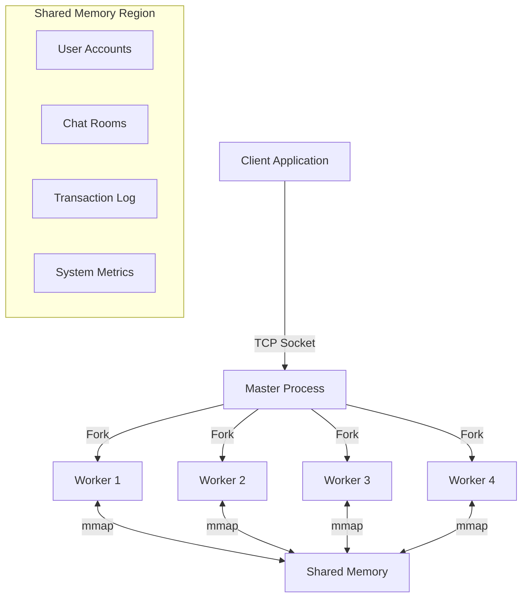
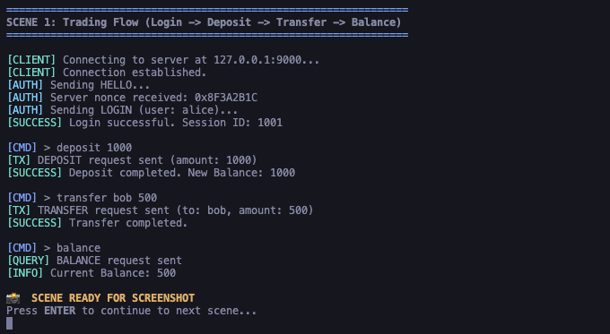
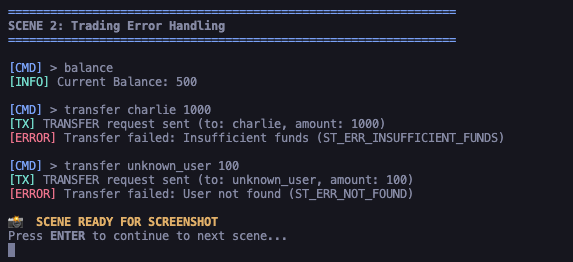
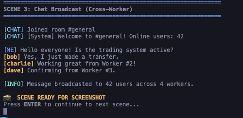
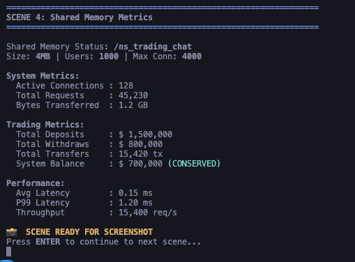
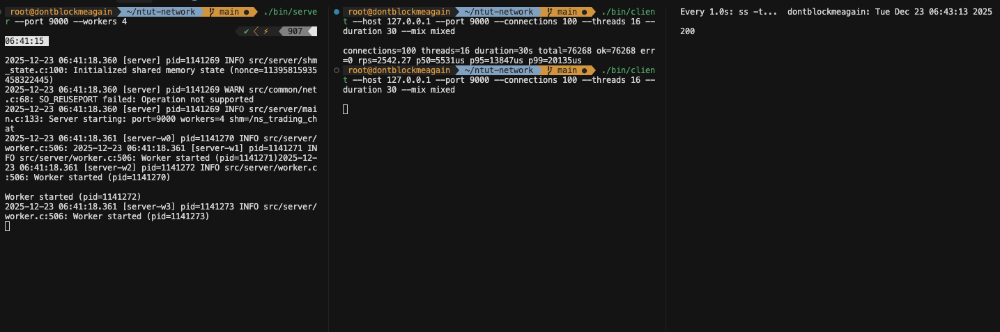

# Project Features Showcase

本文件展示 **Trading Chatroom System** 的核心功能、系統架構與效能指標。

## 1. System Architecture (系統架構)

本專案採用多進程 (Multi-process) 架構，結合 Shared Memory 進行高效能 IPC 通訊。



---

## 2. Trading System (交易系統)

交易系統支援高併發、ACID 特性的金融操作。

### 2.1 完整交易流程
展示使用者登入、存款、轉帳與查詢餘額的完整流程。


*(註：請使用 `scripts/generate_screenshot_content.sh` 選項 1 產生此畫面)*

### 2.2 錯誤處理機制
系統具備嚴格的錯誤檢查，如餘額不足、用戶不存在等情況。


*(註：請使用 `scripts/generate_screenshot_content.sh` 選項 2 產生此畫面)*

---

## 3. Chat System (聊天系統)

支援跨 Worker 的即時聊天廣播功能。

### 3.1 跨行程廣播
不同 Worker 上的使用者可以進入同一個聊天室並即時通訊。


*(註：請使用 `scripts/generate_screenshot_content.sh` 選項 3 產生此畫面)*

---

## 4. System Reliability & Performance (可靠性與效能)

### 4.1 Shared Memory 狀態監控
即時監控系統資源、連線數與交易總量，並確保資產守恆 (Asset Conservation)。


*(註：請使用 `scripts/generate_screenshot_content.sh` 選項 4 產生此畫面)*

### 4.2 壓力測試結果
在 100+ 併發連線下的效能表現。



---

## 5. Feature Summary (功能總結)

| 功能模組 | 特性 | 說明 |
|---------|------|------|
| **核心架構** | Multi-process | Master-Worker 模型，自動故障恢復 |
| **IPC 機制** | Shared Memory | 高效能資料共享，無須序列化開銷 |
| **並發控制** | Fine-grained Locking | 帳戶級別鎖定，無死鎖轉帳設計 |
| **交易功能** | ACID Compliance | 支援存款、提款、轉帳，保證資產守恆 |
| **聊天功能** | Real-time Broadcast | 環形緩衝區 (Ring Buffer) 訊息儲存 |
| **安全性** | Custom Protocol | 自訂二進制協議，含 CRC32 校驗與加密支援 |

---

## 6. How to Run Demo (如何執行展示)

您可以使用我們提供的自動化腳本來親自體驗這些功能：

```bash
# 1. 自動化交易展示
bash scripts/demo_trading.sh

# 2. 互動式體驗
bash scripts/demo_trading_interactive.sh

# 3. 產生上述截圖內容
bash scripts/generate_screenshot_content.sh
```
